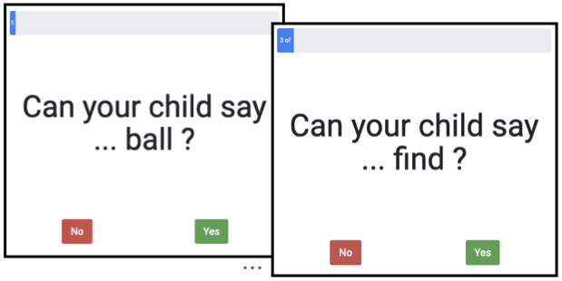

```{r analysis-preferences}
# Seed for random number generation
set.seed(42)
knitr::opts_chunk$set(cache.extra = knitr::rand_seed, 
                      cache = TRUE, 
                      echo = FALSE)
```


```{r setup, include = FALSE}
library(papaja)
library(wordbankr)
library(tidyverse)
library(ggrepel)
library(mirt) 
library(mirtCAT)
library(here)
library(kableExtra)
library(gridExtra)
library(printr)
library(ggpubr)

source(here("scripts/IRT_helpers.R"))
source(here("scripts/01_load_data.R"))
```


# Introduction

Measuring children's early language is important for parents, clinicians and researchers.
The MacArthur-Bates Communicative Development Inventories [CDIs; @Fenson2007] are a set of parent report forms that offer a holistic assessment of children's productive and receptive language skills.
CDIs are low-cost to administer and produce reliable and valid estimates of early vocabulary and other aspects of early language [@fenson1994]. 
The CDIs offer more comprehensive data than a short interaction in the lab with a child [@Fenson2000], because they ask parents to report on vocabulary comprehension as well as production, and other milestones, such as communicative gesture use and use of word combinations. 
Vocabulary size is assessed via a checklist format, which allows caregivers to quickly scan and recognize words their child produces or understands, rather than relying on recall alone. 
Because of these properties, CDI forms have been adapted to dozens of languages. 
Data from CDIs are archived in a central repository [Wordbank; @frank2017], and insights from these data have been used to inform theories of early language learning [@frank2021]. 

Although CDIs measure a variety of other constructs related to early language, our focus here is on vocabulary assessment. 
Across languages, measures of vocabulary on the CDIs are very tightly correlated with other aspects of early language like gesture and grammatical competence [@bates1994;@frank2021]. 
From the perspective of the CDI, it is justifiable to say that the language system is "tightly woven" [@frank2021], meaning that precise measures of early vocabulary provide a good proxy measurement of the language system as a whole. 
<!--Thus, in the remainder of this paper we focus on vocabulary assessment. -->

In American English and Mexican Spanish (two of the original languages in which the CDIs were developed), there are two long-form CDI instruments that focus on different ages.
The 396-item vocabulary checklist on the CDI: Words & Gestures (CDI:WG) was designed for children ages 8--16 months and measures both comprehension and production.
The 680-item vocabulary checklist on the CDI: Words & Sentences (CDI:WS) targets children ages 16--30 months, and includes nearly all of the items from the CDI:WG form, but only measures production. 
<!-- Short forms with shorter vocabulary checklists have been developed [@Fenson2000; @Fenson2007]. -->
The CDI-III is a 100-item checklist meant for children 30--37 months of age, extending the age range for which CDI data are available to 3 years of age.
All CDI forms include words from a range of semantic and syntactic categories. 
For example, the CDI:WS form is comprised of 22 semantic categories representing common early-learned words, including nouns (subdivided into e.g., Body Parts, Toys, and Clothing), action words (e.g. verbs), descriptive words (e.g. adjectives), and closed-class words such as pronouns. 

Although the CDIs have many advantages, one clear drawback is the long length of the vocabulary checklists, which make them time-consuming for parents to complete.
<!-- -- especially burdensome during a period of development when caregivers may have little time to spare. -->
The length of the CDIs also makes it difficult to include them in studies requiring a battery of tasks, as is often the case in both clinical and research settings.
Due to these challenges, there have been a variety of efforts to create shortened versions of the CDI. 
The 100-item short-form CDIs [@Fenson2000; @Fenson2007] are derived from the 680-item CDI:WS form, with items selected based on difficulty and item-to-full score correlations, while also attempting to represent the diversity of semantic and linguistic categories.
While the scores of the short-form CDI:WS are highly correlated with scores on the full CDI:WS, there is evidence for a ceiling effect for children older than 27 or 28 months of age. 

Computerized Adaptive Testing [CAT; @vanderLinden2010] versions of the CDI offer an alternative approach to creating short forms that might remove ceiling (and floor) effects and also hold the potential of further reducing the number of items caregivers must assess.
CAT is a technique that allows test questions to be chosen adaptively based on the learner's responses, analogous to staircasing procedures to find stimuli (e.g., in audiological testing) that are just above/below a given participant's threshold. 
CATs are widely used in education as a way to assess individuals across a broad range of abilities in an efficient and precise manner [e.g., @Weiss1984].
The basis of CAT is item-response theory modeling [IRT; @embretson2013], a technique for the analysis of test data that allows the inference of both the abilities of test takers and the difficulty (and other information) of individual test questions along shared and standardized dimensions. 
CAT models use this item information -- typically extracted from a larger dataset collected via standard testing methods -- to select questions of the appropriate difficulty for a particular test-taker. 
An individual CAT includes a number of components, including the bank of possible items and their difficulties, as well as an algorithm that uses the responses received thus far to choose the next item to give to a test taker, and a rule for when to stop (e.g., after a fixed number of items or after a desired precision has been reached).  

Previous work has applied CAT and related techniques to CDI forms, leveraging the availability of large datasets from previous CDI studies where parents filled out the full forms [@cobo2016computerized;@Makransky2016;@mayor2019;@chai2020].
For example, @Makransky2016 used IRT models fit to normative data from the CDI:WS to develop CAT versions [@Fenson2007]. 
They conducted a simulation study comparing full scores on the CDI to different fixed-length CAT versions (with 5--400 items).
Scores from a CAT of only 50 items had a correlation of $r=0.95$ with the full CDI.
However, for the youngest age group (16--18 month-olds), the correlation with the full CDI was somewhat lower ($r=0.87$).

```{r}
library(wordbankr)
ws <- wordbankr::get_administration_data(language = "English (American)", 
                                         form = "WS")
mod_en_ws <- lm(production ~ age * sex, data = ws) # R^2 = .78 
mod_all_en <- lm(production ~ age * sex, data = d_demo_en) # R^2 = .84 (WG + WS + CDI-III)
```

Following this work but using a slightly different approach, @mayor2019 assessed a range of short forms created via random sampling of words but then scored the form for each child using a procedure that used individual item responses to identify the closest age- and sex-matched participants from the Wordbank database. 
This method performed well in simulations using pre-existing data from English, German, and Norwegian WS forms, with correlations with full CDI scores in excess of .94 for even a 25-item test. 
In addition, this study empirically validated the approach with a small group of parents (19 and 25 for the 25- and 50-item tests, respectively) and found good correlations between the short forms and the full CDI scores for German ($r=.96$ and $r=.94$). 
However, it should be noted that these correlations are not directly comparable to those recovered by the earlier CAT study, because the @mayor2019 method makes use of age and sex information, which is on its own highly diagnostic of vocabulary size ($r = `r round(sqrt(summary(mod_en_ws)$r.squared), digits = 2)`$ for predicting English WS production data with just age and sex).^[The use of age and sex information to predict vocabulary is both a strength and a weakness. 
It is a strength because it generally allows precise estimation with very limited assessment, based on the strong prior expectations that we can have about the vocabulary of a child of a particular age and sex. 
This precision can be very helpful for research. 
On the other hand, the use of prior information of this type in assessment can also be a weakness for individual assessment (especially in the clinical context) because it biases our view of a particular individual based on their demographic characteristics. 
A child with an unusually low or high vocabulary for their age and sex would tend to be assessed as closer to the typical score using this instrument. 
Another way of expressing this issue is that, on average, the use of demographic information trades some bias in exchange for lower variance.]

Most recently, @chai2020 built on the method of @mayor2019 to create an efficient and less data-hungry adaptive technique. 
They used IRT models and standard CAT testing to sample informative items (as opposed to sampling them randomly) but then extrapolate to full CDI scores by using the prior method of finding age- and sex-matched participants whose item responses most closely match those of the current test taker. 
The addition of the IRT-based item selection further boosted performance over the prior results, leading to correlations greater than .95 for tests with 25 items and sometimes even fewer across American English, Danish, Mandarin, and Italian (with the latter two having substantially smaller datasets). 

In sum, previous work strongly suggests that short CAT versions of CDI WS forms achieve strong performance in real-data simulation, and @mayor2019 provide initial validation of these results with a small sample of German speakers. Our goal in the current work is to build on this foundation and to create and validate a maximally versatile set of CATs for English and Spanish. In particular, our contributions are:

1. To assess the fit of a variety of IRT models, determining the best IRT models to serve as a foundation for CDI-CATs.
2. To create and assess CDI-CATs for productive vocabulary in both American English and Mexican Spanish that cover the full age span covered by CDIs -- 12 to 36 months of age.
3. To create and assess CDI-CATs for receptive vocabulary in these two languages, which have not to our knowledge previously been available.
4. To provide evidence for the validity of the productive vocabulary assessment using a larger-scale, web-based concurrent validation study, and
5. To provide access to the CDI-CATs through Web-CDI, an online platform for data collection using CDI-type instruments [@demayo2021]. 

We will first introduce the candidate Item Response Theory (IRT) models, fit them to the datasets, and assess which model is appropriate as the basis for the adaptive CDI. 
Next, we will conduct various CAT simulations to assess the effects of different design choices on test performance, and choose a set of preferred CAT parameters. 
Finally, we report results from a validation study.
We end by discussing the strengths and weaknesses of our approach. 

# Methods

## Item Response Theory Models

A range of IRT models for diverse types of testing scenarios and item types exist [see @Baker2001 for an overview]; we  considered four standard models of increasing complexity that may be appropriate for the dichotomous responses that parents make for each item (word) regarding whether their child can produce that word.
The four models we considered (1-parameter logistic (1PL), 2PL, 3PL, and 4PL) are all widely-used, and introduced below. 
Generally, the 2PL is common for many test scenarios, while the 3PL and 4PL models are for more useful for tests with guessing and lapses, and are more common for multiple-choice tests and tests with high lapse rates (e.g., due to complex questions).

In all four models, the goal is to jointly estimate for each child $j$ a latent ability $\theta_j$, and for each item $i$ one or more parameters capturing characteristics of the item, e.g. difficulty $b_i$, contained in all four models.
In the Rasch (aka 1-parameter logistic; 1PL) model, where only item difficulty is modeled, the probability of child $j$ producing a given item $i$ is 

$$P_{i}(x_i = 1 | b_{i},\theta_j ) = \frac{1}{1 + e^{-D(\theta_j - b_i )}}$$

where $D$ is a scaling parameter (fixed at 1.702) to make the logistic more closely match the ogive function in traditional factor analysis [@R-mirt; @reckase2009].
Thus, children with high latent ability ($\theta$) will be more likely to produce any given item than children with lower latent ability, and more difficult items will be produced by fewer children (at any given $\theta$) than easier items.
The 2-parameter logistic (2PL) model additionally estimates a second parameter per item $i$, discrimination $a_i$, modifying the slope of the logistic (which is 1 in the 1PL model):

$$P_{i}(x_i = 1 | b_{i},a_{i},\theta_j ) = \frac{1}{1 + e^{-D a_{i}(\theta_j - b_i )}}$$

The 3-parameter logistic (3PL) model adds a pseudo-guessing parameter $c_i$, an asymptotic minimum for producing item $i$:

$$P_{i}(x_i = 1 | b_{i},a_{i},c_{i},\theta_j ) = c_i + \frac{1 + c_i}{1 + e^{-D a_{i}(\theta_j - b_i )}}$$
Finally, the 4PL model adds an aymptotic upper bound $d_i$ for producing item $i$:

$$P_{i}(x_i = 1 | b_{i},a_{i},c_{i},d_{i},\theta_j ) = c_i + \frac{d_i - c_i}{1 + e^{-D a_{i}(\theta_j - b_i )}}$$

representing a probability of randomly responding incorrectly.
We used model comparisons to determine which of these four IRT models (1PL, 2PL, 3PL, or 4PL) best explain the CDI data before conducting CAT simulations.

## Datasets

We report analyses for four datasets from Wordbank [@frank2017]: comprehension data from children learning American English or Mexican Spanish (CDI:WG vocabulary checklists), and production data from children learning American English or Mexican Spanish (combining CDI:WG and CDI:WS vocabulary checklists).

### Participants

```{r, count-participants, include=F}
count_na <- function(vec) {
  return(length(which(is.na(vec))))
}

numna_en = apply(d_mat_en, 1, count_na) 
eng_ws_subjs = length(which(numna_en<285)) # 5573
eng_cdi_iii_subjs = length(which(d_demo_en$age>30))
#eng_wg_subjs = nrow(d_mat_en) - eng_ws_subjs - eng_cdi_iii_subjs # 1991 (lost some with missing data?)

numna_sp = apply(d_mat_sp, 1, count_na) 
sp_ws_subjs = length(which(numna_sp<222)) # 1146
#sp_cdi_iii_subjs = length(which(d_demo_sp$age>30)) # only 12 words overlap...
#sp_wg_subjs = nrow(d_mat_sp) - eng_ws_subjs - eng_cdi_iii_subjs
```

The English comprehension dataset consists of Wordbank data from `r eng_wg_subjs` children (12-18 months of age) from the American English CDI:WG.
The Spanish comprehension dataset consists of Wordbank data from `r sp_wg_subjs` children (12-18 months of age) from the Mexican Spanish CDI:WG.
Figure 1A and 1B shows children's CDI:WG scores vs. age for the English and Spanish comprehension datasets, respectively.

The English production dataset consists of the combined production data from Wordbank for `r eng_wg_subjs` children aged 12-18 months from the American English CDI:WG, data from `r eng_ws_subjs` children aged 16-30 months from the English CDI:WS, and data from 69 children aged 31-36 months from the English CDI-III, for a total of `r nrow(d_demo_en)` participants.
Note that these data contain those represented in the norming dataset [@Fenson2007], as well as other contributions[^1].
The Spanish production dataset consists of the combined production data for `r sp_wg_subjs` children from the Mexican Spanish CDI:WG (aged 12 or more months) as well as data from `r sp_ws_subjs` children from the Spanish CDI:WS form (16-30 months), for a total of 1691 participants.
Figure 1C and 1D shows children's production scores vs. age for the English and Spanish production datasets, respectively.
Note that the socioeconomic distributions of these datasets are not matched. 
(See @frank2021 for a discussion of possible effects of socioeconomic status on vocabulary development.)

[^1]: [http://wordbank.stanford.edu/contributors](http://wordbank.stanford.edu/contributors)

```{r, plot-production, echo=F, warning=F, fig.width=6.5, fig.height=5.5, fig.cap="Children's CDI vocabulary plotted by age and sex in each dataset: (A) English comprehension, (B) Spanish comprehension, (C) English production, and (D) Spanish production. Note that we plot fitted quadratics showing extrapolated vocabulary sizes beyond the maximum CDI score, rather than an asymptotic logistic."}

en_prod <- d_demo_en %>% 
  mutate(sex = as.character(sex),
         sex = ifelse(sex=="Other", NA, sex)) %>%
  filter(!is.na(sex)) %>%
  ggplot(aes(x = age, y = production, group = sex, color = sex)) + 
  geom_jitter(alpha = .2) + theme_bw() + 
  stat_smooth(method = "glm", formula = y ~ 0 + x + I(x^2), size = 1) +
  xlab("Age (months)") + ylab("Words Produced") + xlim(11, 37) + ylim(0, 700) +
  ggtitle("English Production")

sp_prod <- ggplot(d_demo_sp, aes(x = age, y = production, group = sex, color = sex)) + 
  geom_jitter(alpha = .3) + theme_bw() + 
  xlab("Age (months)") + ylab("Words Produced") + xlim(11, 32) + ylim(0, 700) +
  stat_smooth(method = "glm", formula = y ~ 0 + x + I(x^2), size = 1) +
  ggtitle("Spanish Production")

en_comp <- demo_eng_wg %>% filter(!is.na(sex)) %>%
  ggplot(aes(x = age, y = comprehension, group = sex, color = sex)) + 
  geom_jitter(alpha = .4) + theme_bw() + ylim(0, 430) +
  stat_smooth(method = "glm", formula = y ~ 0 + x + I(x^2), size = 1) +
  xlab("Age (months)") + ylab("Words Understood") + ggtitle("English Comprehension")

sp_comp <- ggplot(demo_sp_wg, aes(x = age, y = comprehension, group = sex, color = sex)) + 
  geom_jitter(alpha = .4) + theme_bw() + ylim(0, 430) +
  stat_smooth(method = "glm", formula = y ~ 0 + x + I(x^2), size = 1) +
  xlab("Age (months)") + ylab("Words Understood") + ggtitle("Spanish Comprehension")

ggarrange(en_comp, sp_comp,
          en_prod, sp_prod,
          labels = c("A", "B", "C", "D"), 
          ncol=2, nrow=2, common.legend = T)
```

### Instruments

```{r form-overlap}
sp_wg_ws_intersect = length(intersect(sp_wg_items$definition, sp_ws_items$definition))
# 388 / 428 match

sp_wg_not_ws = setdiff(sp_wg_items$definition, sp_ws_items$definition)
# 40 items -- but many of these match, yes? (just plural/parens/etc)

eng_wg_ws_intersect = length(intersect(eng_wg_items$definition, eng_ws_items$definition))
# 394 / 396 match
eng_wg_not_ws = setdiff(eng_wg_items$definition, eng_ws_items$definition)
# WG: "in" / "inside" -> a single WS item ("inside/in")
```

The 680-item vocabulary checklist of the English CDI:WS form is organized into 22 semantic categories (e.g., furniture, games and routines, people). 
The Spanish CDI:WS vocabulary checklist consists of 680 words, organized into 23 semantic categories.
The English CDI:WG vocabulary checklist is comprised of `r nrow(eng_wg_items)` of the easier vocabulary items from the English CDI:WS, and the Spanish CDI:WG is a subset of `r nrow(sp_wg_items)` of the items from the Spanish CDI:WS. <!-- GK: how many actually different? do all 40 match?-->
Of the 100 English CDI-III items, 45 are from the English CDI:WS, and the remaining 55 words were selected to be more appropriate for older children [ages 30-36 months; @Fenson2007].
The 100 items of the Spanish CDI-III, however, overlaps with only 12 items of the Spanish CDI:WS. <!-- right now Spanish CDI-III data is not included -->


When either of the CDI:WG forms was administered, caregivers were asked to indicate for each vocabulary item whether their child 1) understands that word ("comprehends") or 2) both understands and says ("produces") that word. 
Leaving the item blank indicates that the child neither comprehends nor produces that word.
When either of the CDI:WS forms was administered, caregivers were asked to indicate for each vocabulary item on the instrument whether or not their child can recognizably produce (say) the given word.

For the production datasets, "produces" responses were coded as 1 and all other responses were coded as 0.
For the comprehension datasets, both "comprehends" responses (from WG forms) and "produces" responses (from all forms) were coded as 1, and all other responses were coded as 0.
Thus, our datasets consisted of four dichotomous-valued response matrices of size $N$ subjects $\times$ $W$ words ([English, Spanish] $\times$ [production, comprehension]).

### Procedure

Before constructing a CAT, the IRT model with the appropriate structure for the CDI data had to be selected.
Thus, we fitted the four IRT models described above (Rasch/1PL, 2PL, 3PL, 4PL) to each of the four datasets (English and Spanish, comprehension and production) and performed model comparisons.

For the favored model, we then identified ill-fitting items, pruned them, and then used the pruned item bank in a variety of computerized adaptive test (CAT) simulations on Wordbank data, investigating how many items needed to be given to achieve reliable estimates of children's word learning ability across the range of intended ages, and benchmarking CAT performance against randomly-selected baseline tests of the same length.
Finally, based on these simulations we offer a set of preferred CDI-CAT settings and fitted parameters that are recommended to be used by CAT developers for English and Spanish tests of comprehension and production.
After reporting CAT simulations for each dataset with these preferred settings, we conducted an empirical experiment to test the validity of the English production CDI-CAT.


# Results

All models, simulations, and other materials are available on OSF[^2].

[^2]: OSF repository: [https://osf.io/xdp73/](https://osf.io/xdp73/).

## IRT Model Selection

For each dataset, we fitted each of the four standard psychometric models (1PL-4PL) and compared the fits using Akaike and Bayesian Information Criteria (AIC and BIC) to select models with the appropriate level of complexity (i.e. number of parameters) justified by the data.
Model fits were obtained in R [@R-base] using the **mirt** package [@R-mirt].
The results of the model comparisons are shown in the Appendix (Tables A1-A4).

For three of the four datasets, the 2-parameter logistic (2PL) model was preferred by both model selection techniques.
For the large English production dataset (7633 children), the 4PL was preferred by AIC, but the more conservative BIC preferred the 2PL.
In light of the 2PL being preferred in most model comparisons, and for the sake of interpretability, we selected the 2PL model as the basis for our further analyses for all four datasets.
Next, we examined the fitted item difficulty and discrimination parameters of each of the 2PL models to determine if there were any ill-fitting words that should be pruned from the item banks.

## Pruning the Item Banks

IRT models assume that items are locally independent--that is, items in a test should not be related (replying 'yes' to one item should not lead to a 'yes' on another item). 
Local dependence between one or more items may indicate that the latent ability is not unidimensional, and can lead to anomalous estimates for both the item parameters and children's ability.
Thus, we chose to prune any items from use in the CATs that showed both strong local dependence (LD) with one or more other items [Cramer's $V \geq 0.5$; @chen1997local] as well as poor fit to the 2PL model ($\chi^{2}*_{df}$, $p<.001$).
<!-- explain poor fit? -->

### English Comprehension

```{r, pruning-eng-comp, echo=F}
load(here("data/comprehension/eng_wg_2pl_itemfits.Rds"))
load(here("data/comprehension/LD_en.Rds"))
load(here("data/comprehension/eng_wg_mod_2pl.Rds"))

bad_items2pl_x2 = which(itfit2pl_x2$p.X2_star_scaled < .001) # 18
hiLDvio = get_LD_violations(res, assoc_str=.5)
hiLDvio_words_engC = coefs_2pl[which(hiLDvio>0),]$definition 

# items showing strong LD and poor fit
bad_ld_fit = intersect(which(hiLDvio > 0), bad_items2pl_x2) # none

rm(res, itfit2pl, itfit2pl_x2)
```

For the English comprehension model, `r length(bad_items2pl_x2)` items in the full 2PL model had poor fit.
Only one item showed strong LD: "grandma", but this item did not show poor fit; thus no items were pruned from the English comprehension model.

### Spanish Comprehension

```{r, pruning-sp-comp, echo=F}
load(here("data/comprehension/sp_wg_2pl_itemfits.Rds"))
load(here("data/comprehension/LD_sp.Rds"))
load(here("data/comprehension/sp_wg_mod_2pl.Rds"))

bad_items2pl_x2 = which(itfit2pl_x2$p.X2_star_scaled < .001) # 20
hiLDvio = get_LD_violations(res, assoc_str=.5) # 0

# items showing strong LD and poor fit
bad_ld_fit = intersect(which(hiLDvio > 0), bad_items2pl_x2) # none

rm(res, itfit2pl, itfit2pl_x2)
```

For the Spanish comprehension model, `r length(bad_items2pl_x2)` items in the full 2PL model had poor fit.
However, no items showed strong LD; thus no items were pruned from this model.

### English Production

```{r, pruning-eng-prod, echo=F}
load(here("data/production/eng_ws_wg_2pl_itemfits.Rds"))
load(here("data/production/LD_eng.Rds"))
load(here("data/production/eng_ws_wg_mod_2pl.Rds"))

#bad_items2pl = which(itfit2pl$p.S_X2 < .01) # 54 with p<.01 
bad_items2pl_x2 = which(itfit2pl_x2$p.X2_star_scaled < .001) # 142 with p<.001

med_rmsea = median(itfit2pl_x2$RMSEA.X2_star_scaled, na.rm=T) # .01
# no association = abs(V) < .1 no association, .3 is moderate, and .5+ is strong

hiLDvio = get_LD_violations(res, assoc_str=.5)
hiLDvio_words_en = coefs_2pl[which(hiLDvio>0),]$definition # daddy has a strong violation 

# items showing strong LD and poor fit
bad_ld_fit = intersect(which(hiLDvio > 0), bad_items2pl_x2)

d_mat_en = d_mat_en[,-bad_ld_fit]

rm(res, itfit2pl, itfit2pl_x2)
```

For the English production model, `r length(bad_items2pl_x2)` items in the full 2PL model had poor fit ($\chi^{2}*_{df}$, $p<.001$). 
However, only one item showed strong LD: "daddy".
This item also showed poor fit, and was thus pruned from the data for simulated CATs, and the 2PL model used in the CATs was re-fitted without that item. 

### Spanish Production

```{r, pruning-sp-prod, echo=F}
load(here("data/production/sp_ws_wg_2pl_itemfits.Rds"))
load(here("data/production/LD_sp.Rds"))
load(here("data/production/sp_wg_ws_mod_2pl.Rds"))

bad_items2pl_x2 = which(itfit2pl_x2$p.X2_star_scaled < .001) # 142 with p<.001
hiLDvio = get_LD_violations(res, assoc_str=.5)
hiLDvio_words_sp = coefs_2pl[which(hiLDvio>0),]$definition 

# items showing strong LD and poor fit
bad_ld_fit = intersect(which(hiLDvio > 0), bad_items2pl_x2)

d_mat_sp = d_mat_sp[,-bad_ld_fit]
# check: intersect(c("mamá","no"), colnames(d_mat_sp))

rm(res, itfit2pl, itfit2pl_x2)
```

For the Spanish production model, `r length(bad_items2pl_x2)` items in the full 2PL model had poor fit ($\chi^{2}*_{df}$, $p<.001$).
Two items showed strong LD: "mamá" and "no".
These items also showed poor fit, and were thus pruned from the data, and the 2PL model was re-fitted without them.


```{r load-pruned-models, echo=F}
# final IRT models
prod_mod <- list()
comp_mod <- list()
# final IRT parameters
prod_pars <- list()
comp_pars <- list()
# final IRT fscores
prod_fs <- list()
comp_fs <- list()

# final pruned English production model
load(here("data/production/eng_ws_wg_mod_2pl_nobad.Rds"))
prod_mod$en = mod_2pl
prod_pars$en = coefs_2pl
d_demo_en <- d_demo_en %>% left_join(fscores_2pl %>% 
                                       mutate(data_id = as.numeric(data_id)), by="data_id")
prod_fs$en = fscores_2pl
# final pruned Spanish production model
load(here("data/production/sp_ws_wg_mod_2pl_nobad.Rds"))
prod_mod$sp = mod_2pl
prod_pars$sp = coefs_2pl
d_demo_sp <- d_demo_sp %>% left_join(fscores_2pl %>% 
                                       mutate(data_id = as.numeric(data_id)), by="data_id")
prod_fs$sp = fscores_2pl
# final unpruned English and Spanish comprehension models
load(here("data/comprehension/eng_wg_mod_2pl.Rds"))
comp_mod$en = mod_2pl
comp_pars$en = coefs_2pl
d_demo_en <- d_demo_en %>% left_join(fscores_2pl %>% rename(comp_ability = ability) %>%
                                       mutate(data_id = as.numeric(data_id)), by="data_id")
comp_fs$en = fscores_2pl
demo_eng_wg <- demo_eng_wg %>% left_join(fscores_2pl %>% 
                                       mutate(data_id = as.numeric(data_id)), by="data_id")

load(here("data/comprehension/sp_wg_mod_2pl.Rds"))
comp_mod$sp = mod_2pl
comp_pars$sp = coefs_2pl
d_demo_sp <- d_demo_sp %>% left_join(fscores_2pl %>% rename(comp_ability = ability) %>%
                                       mutate(data_id = as.numeric(data_id)), by="data_id")
comp_fs$sp = fscores_2pl
demo_sp_wg <- demo_sp_wg %>% left_join(fscores_2pl %>% 
                                       mutate(data_id = as.numeric(data_id)), by="data_id")

en_full_prod_vs_comp_theta = with(d_demo_en, 
                                  cor.test(ability, comp_ability, na.rm=T)) # .65
sp_full_prod_vs_comp_theta = with(d_demo_sp, 
                                  cor.test(ability, comp_ability, na.rm=T)) # .75

en_prod_vs_theta = with(d_demo_en, cor.test(production, ability)) # .93
sp_prod_vs_theta = with(d_demo_sp, cor.test(production, ability)) # .90

#cor(d_demo_en$age, d_demo_en$production) # .81
#cor(d_demo_en$age, d_demo_en$ability) # .81
# Age is correlated equally strongly with production sumscore as with ability.
#cor(d_demo_sp$age, d_demo_sp$production) # .64
#cor(d_demo_sp$age, d_demo_sp$ability) # .63
```


## Data Imputation

Using the per-child, per-item responses, we simulated a variety of CATs with different settings.
However, a final preprocessing step was needed for the production datasets: for participants' whose data comes from either the CDI:WG form or from the CDI-III, it was necessary to impute their responses for any of the 680 CDI:WS items they were not asked.
We did this imputation using the participants' estimated production ability and the appropriate 2PL model.
Overall, `r round(100*sum(is.na(d_mat_en))/length(d_mat_en),1)`% of the data was missing from the English production dataset, and was imputed.
`r round(100*sum(is.na(d_mat_sp))/length(d_mat_sp),1)`% of the data was missing from the Spanish production dataset, and was imputed.

```{r, impute-missing-data, echo=F, warning=F}
set.seed(123)

d_mat_en = imputeMissing(prod_mod$en, 
                         Theta=fscores(prod_mod$en)) 
d_mat_sp = imputeMissing(prod_mod$sp, 
                         Theta=fscores(prod_mod$sp))
# Imputing too much data can lead to very conservative results. Use with caution.
```

## CAT Simulations

We used real data simulations to estimate how well the CDI would perform were it administered with varying CAT procedures.
That is, we used the four Wordbank datasets of full CDI administrations to simulate CATs, selecting the succession of items based on caregiver's actual responses from the full CDI, and assuming that their responses to the subset of the items on the CAT would be the same as they had been on the full CDI.
Thus, for each simulated CAT procedure, we derived an estimate of each child $i$'s language ability ($\theta_{i}$).
These CAT-estimated abilities were then compared (e.g., by correlation, reliability, and error) to children's IRT-estimated ability from the full CDI.\footnote{Note that we use the term ``ability from full CDI'' to mean a score based on the IRT parameters for all items, whereas ``full CDI vocabulary'' refers to the conventional score of the number of positively checked items.}
We used this general approach to conduct three sets of CAT simulations, for each of the four datasets.
The three simulations tested CATs with 1) a fixed number of items, 2) a threshold for early stopping, and 3) our preferred CAT settings, on the basis of the prior simulations.

### Fixed-length CATs

Following the approach taken by Makransky et al. (2016), we first ran a series of fixed-length CAT simulations and compared children's CAT-estimated ability to their IRT-estimated ability from their full CDI data. 
Each successive item (including the first item) was selected to be maximally informative of ability, given by the maximum a posteriori (MAP) estimate.
For the production datasets, we varied test lengths from 25 to 400 items, while for the comprehension datasets we simulated CATs only up to 300 items due to the shorter length of the WG forms.
We also added a comparison to a baseline test that selected a random set of CDI questions for each child of the same length as the CAT for that child.
For each test length, comparisons of children's CAT-estimated ability to their full CDI IRT-estimated ability are shown in the Appendix (Tables B1-B4).
Overall, results were quite good even for 25-item tests, with $r = .99$ for both production datasets, $r = .98$ for English comprehension, and $r = .97$ for Spanish comprehension.
50-item tests brought the production correlations close to 1, and the comprehension correlations to .99.
Compared to the production correlations reported by Makransky et al. (2016) for the same test lengths, these values are somewhat higher, likely due to the larger Wordbank datasets used here.
However, we also found that the baseline of randomly-selected items also showed a strong association with ability from the full CDI ($r \sim .94$ for 25 items; $r \sim .97$ for 50 items).
Nonetheless, the mean standard error of measurement (SEM) of ability estimates from the short CATs are roughly half that of the random tests (e.g., English production: 50-item CAT mean SEM = .13; 50-item random test mean SEM = .24).
Even the longest tests only brought the mean SEM down to $\sim 0.1$--and the longer random tests all have similar values, showing a diminishing advantage of longer CATs.

We also note that on the shorter CAT simulations, a large number of items were never selected.
For example, on the 50-item production CATs, 347 of the 680 items were never selected for any of the 7633 English CATs, and a similar number of items were never selected for any of the 1692 simulated Spanish CATs.
<!-- This suggests that for researchers who are only interested in estimating children's overall production ability, a non-adaptive test of ~330 items (the pool of all items selected at least once for the 50-item CATs) might serve them quite well. Philip thinks we should cut this -->
For comprehension, roughly 150 of the WG items were never selected for any of the simulated 50-item CATs. 
<!--suggesting a non-adaptive WG form with many fewer items may also perform well for estimating children's comprehension ability.-->

### Early-stopping CAT Simulations

Having ascertained that fixed-length forms as short as 25 to 50 items can estimate children's language ability with high reliability, we next evaluated how well early-terminating CATs operate.
We chose to evaluate CATs that stop after either reaching an estimated standard error of measurement (SEM) for a given child's ability reaches 0.10, a quite strict criterion. 
Note from the fixed-length CAT simulations that on average, SEM only approaches this criterion, but lower SEM for many children will allow for earlier termination for many and thus potentially a much shorter average administration.
For each participant in each dataset, we simulated CATs using a maximum of 25, 50, 75, 100, 200, 300, or (for production datasets only) 400 items, with early termination if the estimated SEM reaches 0.10 for a given subject.
The results of these CAT simulations are shown in the Appendix (Tables B5-B8).

The simulation results for English and Spanish comprehension (Tables B5 and B6) were broadly similar, with reliability for maximum 50-item tests at 0.981 (English) and 0.979 (Spanish), and improving by $<.007$ for even the longest (300-item) tests.

The results for English production (Table B7) show that reliability for the 25-item early stopping CAT is the same as for the fixed-length CAT (0.975), which is unsurprising since the CAT terminated early for very few participants (mean items = 24.7).
For the 50-item CAT, the participants received a median of 45 items (mean = 39.5), and reliability was quite high (0.981).
Allowing for longer CATs (maximum 75-400 items) showed minimal gains in reliability (0.983 to 0.985), and while the mean length of the CATs steadily increased (58.7 to 143.1), the median number of items administered remained constant at 45.

The simulation results for Spanish production (Table B8) were largely consistent with those for English: participants rarely received fewer than 25 items, and the median number of items administered on tests that allowed 50 or more items stayed constant at 36 items.
Tests with a maximum of 50 items were already quite reliable (0.975), and longer tests did not greatly increase reliability (0.976 to 0.979).

On balance, for all datasets it seems that tests with a minimum of 25 items are needed to approach an estimated SEM of 0.10 for many participants, and that allowing up to 50 items in total can sufficiently improve the reliability of the CAT without much increasing the mean/median test length, while tests with more than 50 items show only small improvements on reliability that seem unwarranted given the increasing demands on administration time.
We use these insights to specify and test our preferred settings for English and Spanish production and comprehension CATs.

<!-- Below we show the distribution of ability (theta) from the 2PL model by age. -->

```{r, theta-by-age, include=F, echo=F, fig.width=6, fig.height=3.8, fig.cap="Children's ability vs. age (A) and total CDI score vs. ability (B) for the English production dataset."}
# Overlaid histograms
#ggplot(d_demo_en, aes(x=ability, fill=age_group)) +
#    geom_histogram(binwidth=.5, alpha=.5, position="identity") + theme_classic() +
#  xlab("Ability (Theta) Estimates from 2PL") +
#  labs(fill="Age Group") + ylab("Number of Participants")

p1 <- ggplot(d_demo_en, aes(x=jitter(age), y=ability)) +
  geom_point(alpha=.1) + theme_classic() +
  xlab("Age (mos)") + ylab("Estimated Ability")

p2 <- ggplot(d_demo_en, aes(x=production, y=ability, color=age)) + 
  geom_point(alpha=.1) + theme_classic() +
  xlab("Total CDI Score") + ylab("Estimated Ability")

# Density plots with semi-transparent fill
#ggplot(d_demo, aes(x=ability, fill=age_group)) + geom_density(alpha=.3) + theme_classic()

ggarrange(p1, p2, ncol=2, labels = c("A", "B"))
```

### Preferred CAT Settings

Based on the fixed-length and early-terminating CAT simulations, it seems clear that even a minimum of 25 items can often lead to a stable estimate of children's language ability, but that in some cases it is helpful to have the flexibility to have slightly longer tests of up to 50 items to further reduce estimation error.
Thus, we chose to test -- first via simulation, and then in an empirical validation of English production -- CATs with a minimum of 25 items, a maximum of 50 items, and early termination when the estimated SE $\leq .15$.\footnote{In the early-stopping CAT simulations, we found that the stricter SE $\leq .10$ criterion was never met on average, even for tests of 300 or more items.}

We further compare two ways of estimating subject's ability: *maximum likelihood* (ML) returns the ability value that is most likely based only on the observed data, whereas the *maximum a posteriori* (MAP) estimate differs slightly in that it incorporates a prior expectation that ability is drawn from a normal distribution.
Since MAP estimates are regularized (i.e., extreme values are pulled in slightly towards the higher-probability center) in comparison to ML estimates, MAP estimates may be more stable and perhaps less extreme-valued in the tails.

Finally, we test two ways of choosing the starting item: we either use the maximally informative item, as in all prior simulations, or we use age-based starting items that are chosen to be slightly easy relative to each subject's age $i$ (i.e., with difficulty $d_i \approx \theta_{i} - .5$, where $\theta_i$ is the average ability of children of that age).
We evaluated using starting items that are somewhat easy for children of a given age so that most parents will be presented with at least one item that their child is likely to know.
If the maximally informative start item across all ages were used, parents of younger and/or lower-than-average ability may be presented predominantly with words that their child does not know, which may concern them.
Thus, if an age-based starting item does not impact the CAT's performance, we will recommend their use to mitigate this concern and to grant most parents the opportunity to use all response alternatives.

Tables 1-4 show the results of the CAT simulations for each dataset with the preferred settings.
MAP ability estimates resulted in lower mean SE, slightly higher correlations with ability estimates from the full CDI, and also resulted in an average of 1 fewer item being asked per CAT.
MAP ability estimates were strongly correlated with ability estimates from the full CDI, with $r=.99$ for both English and Spanish production, and $r=.98$ or higher for comprehension.
On average, 32-34 items were asked on the simulated CATs (median = 25 for all four datasets), showing that for most children the CATs terminated much before the 50-item maximum. 
Finally, the use of easy age-based starting items had no discernible impact on the reliability of the CAT-estimated ability in comparison to using the maximally informative starting item.

Tables B9-B12 in the Appendix show the correlation between ability estimates for these preferred CAT settings and ability estimates from the full CDI broken down by age (3-month age bins for production; 2-month age bins for comprehension), which revealed consistently high correlations ($r$s = [.96,.99]) across English and Spanish for both production and comprehension.
In summary, these simulation results suggest that a CAT with 25-50 items, terminating when the estimated SEM $\leq .15$, using MAP-based ability estimation and age-based starting items will allow for efficient and reliable estimation of young children's ability for both language comprehension and production, in both English and Spanish. 

<!-- ### English Production -->

```{r, preferredCAT-tab-en-prod, echo=F}
load(here("data/production/preferredCAT_en.Rds"))

get_preferred_cat_table <- function(d_mat, fs) {
  cat_tab_cols = c("Scoring / Start Item", 
                    "Median Items",
                    "Mean Items", 
                    "r with full CDI", 
                    "Mean SE", 
                    "Reliability", 
                    "Unused Items")
  pref_tab = summarize_CAT(min25_max50_ML, d_mat, fs)
  pref_tab = rbind(pref_tab, summarize_CAT(min25_max50_MAP, d_mat, fs))
  pref_tab = rbind(pref_tab, summarize_CAT(min25_max50_ML_age, d_mat, fs))
  pref_tab = rbind(pref_tab, summarize_CAT(min25_max50_MAP_age, d_mat, fs))
  pref_tab = data.frame(pref_tab)
  pref_tab$cond = c("ML / MI", "MAP / MI", "ML / age-based", "MAP / age-based")
  names(pref_tab) = cat_tab_cols
  pref_tab$`Median Items` = NULL
  pref_tab$`Unused Items` = NULL
  return(pref_tab)
}

pref_tab <- get_preferred_cat_table(d_mat_en, prod_fs$en)

apa_table(pref_tab, digits=c(0, 1, 3, 3, 3), caption="English production CAT simulations with preferred settings.") 
```


<!-- ### Spanish Production -->

```{r}
load(here("data/production/preferredCAT_sp.Rds"))

pref_tab <- get_preferred_cat_table(d_mat_sp, prod_fs$sp)

apa_table(pref_tab, digits=c(0, 1, 3, 3, 3), caption="Spanish production CAT simulations with preferred settings.")
```


<!-- ### English Comprehension -->

```{r}
load(here("data/comprehension/preferredCAT_eng.Rds"))

pref_tab <- get_preferred_cat_table(en_mat_wg, comp_fs$en)

apa_table(pref_tab, digits=c(0, 1, 3, 3, 3), caption="English comprehension CAT simulations with preferred settings.")
```


<!-- ### Spanish Comprehension -->

```{r, preferredCAT-tab-sp-comp, echo=F}
load(here("data/comprehension/preferredCAT_sp.Rds"))

pref_tab <- get_preferred_cat_table(sp_mat_wg, comp_fs$sp)

apa_table(pref_tab, digits=c(0, 1, 3, 3, 3), caption="Spanish comprehension CAT simulations with preferred settings.")
```


# Validation Study

To empirically test the validity of the model as a short version of the CDI vocabulary checklist, we administered both the full MB-CDI:WS form and the English production CDI-CAT to the parents of English-speaking children. 

## Methods 


### Participants

```{r validation-participants}
# all data (without quality exclusions)
load(here("data/validation/processed_data.Rdata"))
# kept_demo / dropped_demo
load(here("data/validation/processed_exclusions_data.Rdata"))

#exclusions criteria
excluded_demo_reason <- dropped_demo %>% 
  mutate(mismatch_sex = ((sex_cat == "M") & (sex_full == "Female")) | ((sex_cat == "F") & (sex_full == "Male")),
         mismatch_age = age_cat != age_full,
         mismatch_birthweight = birth_weight_lb_cat != birth_weight_confirmation_lb_cat |
           (birth_weight_lb_cat<5 | birth_weight_lb_cat>9),
         mismatch_zip = zip_code_cat != zip_code_full,
         primary_yob = primary_yob_cat != primary_yob_confirmation_cat,
         multilingual = (language_days_per_week_cat * language_hours_per_day_cat) >0) %>%
  select(subject_id, mismatch_sex, mismatch_age, mismatch_birthweight, mismatch_zip, primary_yob, multilingual) %>%
  mutate(num_true = rowSums(. == TRUE, na.rm = T))

one_reason <- excluded_demo_reason %>% filter(num_true == 1)
mult_reason <- excluded_demo_reason %>% filter(num_true != 1)

#time between completion of study A and completion of study B
demo <- demo %>% 
  mutate(time_diff_hours = difftime(last_modified_full, last_modified_cat, 
                                    units = "hours"),
         time_diff_days = difftime(last_modified_full, last_modified_cat, 
                                    units = "days"))


excluded_subjs <- unique(dropped_demo$subject_id)

resps <- resps %>% filter(!is.element(subject_id, excluded_subjs))
kept_demo <- demo %>% filter(!is.element(subject_id, excluded_subjs))

# "exclude participants who respond differently on 75% or more of the 25-50 CDI-CAT items, as compared to their responses on the same items on the CDI-WS"

per_subj <- resps %>% filter(response_cat!="no_test") %>%
  mutate(resp_agrees = response_full==response_cat,
         CATproduces = case_when(response_cat == "produces" ~ 1,
                              response_cat == "no_produces" ~ 0,
                              TRUE ~ NA_real_)) %>%
  group_by(subject_id) %>% 
  summarise(agreement = mean(resp_agrees), n=n(), CATpropyes = sum(CATproduces) / n) %>% 
  arrange(agreement)

bad_Ss = per_subj %>% filter(agreement <= .25) # no participants excluded 
```

We recruited caregivers of `r nrow(demo)` children between `r min(demo$age_cat)` and `r max(demo$age_cat)` months of age from the online survey vendor Prolific. 
`r nrow(dropped_demo)` participants were excluded according to our preregistered exclusion criteria.[^3] 
The exclusion criteria included discrepancies between questions about the child's age (n = `r sum(one_reason$mismatch_age, na.rm = T)`), child's sex (n = `r sum(one_reason$mismatch_sex, na.rm = T)`), child's birth weight (n = `r sum(one_reason$mismatch_birthweight, na.rm = T)`), caregiver's zipcode (n = `r sum(one_reason$mismatch_zip, na.rm = T)`), caregiver's year of birth (n = `r sum(one_reason$primary_yob, na.rm = T)`), amount of exposure to languages other than English in the home (n = `r sum(one_reason$multilingual, na.rm = T)`), or multiple violations of any of the previous exclusion criteria (n = `r nrow(mult_reason)`). 
Data from the remaining `r nrow(kept_demo)` (103 female) children were analyzed.

[^3]: Preregistration: [https://aspredicted.org/h2kz4.pdf](https://aspredicted.org/h2kz4.pdf)

### Procedure
```{r administration procedure}
#administration order
full_first <- filter(kept_demo, order == "full_first")
cat_first <- filter(kept_demo, order == "cat_first")

#proportion administrations with gap
time_gap_one_day <- kept_demo %>% filter((time_diff_hours > 6 & time_diff_hours < 24) | 
                                      (time_diff_hours < -12 & time_diff_hours > -6))

time_gap_multi_day <- kept_demo %>% filter((time_diff_hours > 24) | 
                                        (time_diff_hours < -24))
```

Caregivers were asked to complete both the full CDI:WS and a production CDI-CAT alongside a comprehensive demographics form. 
Both surveys and the demographics form were administered within the Web-CDI interface [@demayo2021]. 
In Web-CDI, caregivers receive a link that takes them to each form to complete.
Instructions are provided in written and pictorial form.
The user interface of the CDI-CAT differs from that of the full Web-CDI.
In the full CDI, each page presents all of the items in each of the semantic categories, ranging from 6 items (connecting words) to 103 items (action words).
In the CDI-CAT, caregivers are presented with one word at a time and asked to select "Yes" or "No" to indicate whether their child can say that word (see Figure \ref{fig:cat-procedure}). 
For items that are ambiguous when presented in isolation, information about the type of word was included in parentheses to help parents identify the target word (e.g., "drink (verb)" vs. "drink (object)").
The order of survey administration was counterbalanced so n = `r nrow(full_first)` caregivers received the full CDI followed by the CDI-CAT and demographics while n = `r nrow(cat_first)` participants received the CDI-CAT and demographics followed by the full CDI:WS. 
This was done to enable analysis of possible carryover effects from one version of the assessment to the other.
Caregivers were asked to complete both surveys in one sitting, but `r nrow(time_gap_one_day)/nrow(kept_demo)*100`% of caregivers (n = `r nrow(time_gap_one_day)`) returned their second survey within 24 hours and `r nrow(time_gap_multi_day)/nrow(kept_demo)*100`% (n = `r nrow(time_gap_multi_day)`) returned their second survey within 5 days. 

```{r cat-procedure, echo=FALSE, fig.cap="Screenshots of the English production CDI-CAT user interface.", out.width = '65%'}

```

## Results and Discussion

```{r, include=F}
full_w <- resps %>% arrange(definition) %>%
  select(-response_cat) %>%
  mutate(item = definition, 
         produces = case_when(response_full == "produces" ~ 1,
                              response_full == "no_produces" ~ 0,
                              TRUE ~ NA_real_)) %>% 
  pivot_wider(id_cols = "subject_id", 
              names_from = item, 
              values_from = produces) %>%
  arrange(subject_id)

cat_w <- resps %>% #filter(response_cat!="no_test") %>%
  arrange(definition) %>%
  select(-response_full) %>%
  mutate(item = definition, 
         produces = case_when(response_cat == "produces" ~ 1,
                              response_cat == "no_produces" ~ 0,
                              TRUE ~ NA_real_)) %>%
  pivot_wider(id_cols = "subject_id", 
              names_from = item, 
              values_from = produces,
              values_fill = NA) %>%
  arrange(subject_id)

prod_s <- full_w %>% mutate(production = Reduce("+",.[2:681])) %>%
  select(subject_id, production) %>% 
  left_join(demo %>% select(subject_id, sex_full, age_full, order), by="subject_id")

full_mat <- as.matrix(full_w %>% select(-subject_id))
cat_mat <- as.matrix(cat_w %>% select(-subject_id))

load(here("data/production/eng_ws_wg_mod_2pl.Rds"))

full_thetas <- data.frame(fscores(mod_2pl, method="MAP", response.pattern = full_mat)[,c("F1","SE_F1")])
cat_thetas <- data.frame(fscores(mod_2pl, method="MAP", response.pattern = cat_mat)[,c("F1","SE_F1")])

prod_s$fullTheta <- full_thetas[,1]
prod_s$fullTheta_SE <- full_thetas[,2]
prod_s$catTheta <- cat_thetas[,1]
prod_s$catTheta_SE <- cat_thetas[,2]
```

```{r, echo=F}
full_vs_cat_theta <- with(prod_s, cor(fullTheta, catTheta)) # .92
prod_vs_cat_theta <- with(prod_s, cor(production, catTheta)) # .86
full_theta_vs_sumscore <- with(prod_s, cor(production, fullTheta)) # .95
```

```{r, echo=F}
# t-test on ability differences based on test order
prod_s <- prod_s %>% mutate(sq_err = (fullTheta - catTheta)^2,
                            full_cat_diff = fullTheta - catTheta)

sq_err_test <- t.test(subset(prod_s, order=="full_first")$sq_err, 
                      subset(prod_s, order=="cat_first")$sq_err)

full_cat_diff_test <- t.test(subset(prod_s, order=="full_first")$full_cat_diff, 
                             subset(prod_s, order=="cat_first")$full_cat_diff)

bad_thresh <- mean(prod_s$sq_err) + 1.5*sd(prod_s$sq_err) # mean=.55, med = .17
bad <- subset(prod_s, sq_err > bad_thresh) # 18
good <- subset(prod_s, sq_err <= bad_thresh) # 186
#t.test(prod_s$full_cat_diff) # CAT on average shows higher ability (mean=.52)
#t.test(good$full_cat_diff) # mean=.40 even without the 18 outliers showing the largest error

#mean(bad$full_cat_diff)
# table(bad$order) # 11 / 18 discrepant participants did the full CDI first
```

We carried out our preregistered[^4] comparisons of children’s estimated latent language ability from the CDI-CAT to their ability estimated from the full CDI:WS, as well as to their full CDI:WS vocabulary.
Figure \ref{fig:cat-vs-full-cdi} shows participating children's ability scores estimated from the full CDI:WS vs. their ability scores from the CDI-CAT, which were strongly correlated ($r = `r round(full_vs_cat_theta, 2)`$), for both females and males.
The correlation between participants' total vocabulary from the full CDI:WS vs. their CAT-estimated ability was $r = `r round(prod_vs_cat_theta, 2)`$.
For reference, participants' total vocabulary from the full CDI:WS was also strongly correlated with their ability estimated from their full CDI:WS ($r = `r round(full_theta_vs_sumscore, 2)`$).
To test whether there was an effect of test administration order, we conducted a t-test on the squared differences between children's CAT-based ability and their ability from the full CDI:WS, and found no significant difference in the amount of squared error as a function of test order.
The mean squared error between CDI-CAT and full CDI ability was `r round(mean(prod_s$sq_err), 2)` (median = `r round(median(prod_s$sq_err), 2)`, sd = `r round(sd(prod_s$sq_err), 2)`).
Of the `r nrow(bad)` participants who showed extreme discrepancy (> mean + 1.5*sd = `r round(bad_thresh, 2)`; 11 of whom did the full CDI first), all yielded a much higher CDI-CAT ability as compared to their ability on the full CDI (mean CAT ability - full CDI ability = `r round(-mean(bad$full_cat_diff), 2)`).
In comparison to their responses on the full CDI, these participants generally responded 'knows' to many more items on the CDI-CAT than they should have. <!-- add proportion of disagreement for this sample? -->
It is not clear if these caregivers were too quick to endorse knowledge for items on the CDI-CAT, or perhaps neglected to attend to all of the items on the full CDI, where a default response indicates lack of knowledge. 
To attempt to calibrate caregivers, it may be advisable to stress in the instructions for a CDI-CAT that the test is intended to be difficult, and that they should expect to be asked about many words (at least 50%) that their child is unlikely to know yet.


[^4]: Preregistration: [https://aspredicted.org/h2kz4.pdf]()

Nonetheless, the results largely validate that the English production CDI-CAT works well for measuring language ability across a broad age range.
Table 5 shows the correlations between children's ability from the CDI-CAT vs. the full CDI by age group, indicating generally strong associations across the entire age range. 
The 27-30 month age bin shows a slightly weaker association, but with small sample sizes (<30) for some age bins this may be due to sampling variability.
Figure C1 in the Appendix shows that the relationships between children's age and 1) their total vocabulary from the full CDI:WS (left), 2) their full CDI ability (middle), and 3) their ability measured from the CDI-CAT (right) are all of approximately the same strength, and show the expected female advantage.


```{r cat-vs-full-cdi, echo=F, fig.width=4.5, fig.height=3.8, fig.cap="Children's estimated ability from the full CDI:WS vs. estimated ability from the CDI-CAT, by sex of child."}
prod_s %>% rename(Sex=sex_full) %>%
  ggplot(aes(x = fullTheta, y = catTheta, color=Sex)) + geom_point(alpha=.7) + 
    geom_errorbar(aes(ymin = catTheta-catTheta_SE, ymax = catTheta+catTheta_SE), alpha=.7) + 
    geom_errorbarh(aes(xmin = fullTheta-fullTheta_SE, xmax = fullTheta+fullTheta_SE), alpha=.7) +
  theme_classic() + xlab("Ability from full CDI") + ylab("Ability from CAT") +
  geom_abline(slope=1, intercept=0, linetype="dashed") +
  geom_smooth(method=lm)# + 
  #stat_cor(inherit.aes = F, aes(x=fullTheta, y=catTheta, 
  #             label = paste(..rr.label.., sep = "~`,`~")))
```


```{r, echo=F}
valid_tab <- prod_s %>% 
  mutate(age_group = cut(age_full, breaks=seq(12,36,3), right=F, include.lowest = T)) %>%
  group_by(age_group) %>%
  summarise(r = cor(fullTheta, catTheta), n=n()) #%>% kableExtra::kable(digits=2)

valid_tab_wide = rbind(round(valid_tab$r, 2), as.character(valid_tab$n))
colnames(valid_tab_wide) = as.character(valid_tab$age_group)
row.names(valid_tab_wide) = c('r CAT vs. full CDI', 'N')

apa_table(valid_tab_wide, caption="Validation study ability correlations (CDI-CAT vs. full CDI) by age group.") 
```

# Discussion

We set out to build a computerized adaptive version of the CDI (CDI-CAT) to assess language ability in young children by asking parents 25-50 vocabulary questions -- much shorter than the 680 vocabulary items on the full CDI:WS.
After finding that our preferred CAT settings work well in simulation for estimating the language ability of thousands of children from Wordbank [@frank2017] in American English and Mexican Spanish, for both production and comprehension, we ran a validation study to establish the empirical reliability of the CDI-CAT for measuring English production ability.
The validation study found a strong correlation between ability estimated by the CDI-CAT and ability estimated from the full CDI:WS, and this correlation was strong across age ranges and sex.

Building on earlier work using IRT-based models to construct CAT measures of vocabulary [@Makransky2016;@mayor2019;@chai2020], we have improved on a few aspects.
First, we have leveraged larger datasets than prior work by stitching together production Wordbank data [@frank2017; @frank2021] from multiple CDIs, allowing for more precise, stable item parameter estimates that we expect will generalize well to future samples across a broad age range.
The use of such large datasets also enabled us to conduct model comparisons of several standard IRT models (1PL-4PL), which established that the 2-parameter logistic (2PL) IRT model achieves the right balance of complexity and fit for all four of our datasets, fitting per-item difficulty and discrimination (slope) parameters.
As the 2PL model works best for both languages investigated here, we expect that the 2PL model will also operate best when extending this approach to build CDI-CATs for other languages.
Another extension made in our work is the application of IRT models and CAT simulations to data regarding children's language comprehension.
The simulation results were promising, suggesting that these comprehension CATs will likely function as well as those for production.
Moreover, the proposed production CDI-CATs operate over a wider age range (12-36 months) than any of the individual CDI forms upon which they are based (CDI:WG, CDI:WS, or CDI-III).
These production CDI-CATs should serve robustly estimate language ability for outlier children at both extremes (i.e., young children with high ability, and older children with lower ability).
The CDI-CAT is also an excellent choice for longitudinal studies: due to the small number of items given per administration and its adaptive nature, as children age they will be unlikely to see the same item more than once.
Finally, we have conducted an empirical study to test the validity of the preferred CAT English production settings which is larger than has been run in prior studies, with encouraging results.
In summary, we have shown how to build CDI-CATs of only 25-50 items using 2PL IRT models for both comprehension and production in two languages (American English and Mexican Spanish), and offer these item banks and parameters[^5] for other researchers. 
We hope that a similar approach will be taken in the future to build other CAT-based vocabulary measures.

[^5]: CAT item bank and parameters: [https://osf.io/xdp73/](https://osf.io/xdp73/)

Despite all of the benefits of the CDI-CAT, there remain several limitations.
First, as with other short-form CDIs, the CDI-CAT provides very little information about individual items and relatedly, about vocabulary composition. 
The item selection procedure provides no guarantee on the number of items tested per lexical class or semantic category.
Second, unlike paper-based forms which can simultaneously ask parents about children's comprehension and production of each item, the current CDI-CATs assess comprehension and production separately, requiring two sessions if both are needed.
Future work may consider fitting a multidimensional IRT model to estimate production and comprehension difficulties for each item, and testing a multidimensional CAT to jointly assess production and comprehension abilities simultaneously [e.g., @van2016multidimensional].
Third, it may be ill-advised to use the CDI-CAT to measure the effectiveness of some interventions, especially those targeting vocabulary. 
Different items will be queried pre- and post-test, and thus there will be variability in overlap between intervention target and CAT items both between participants and between testing times, and this would be a confounder for intervention effect [@Makransky2016].
Finally, the IRT parameters in these CDI-CATs have been fitted on monolingual children, and it is an open question whether the items function the same way for bilingual or multilingual children.
Despite these caveats, we are encouraged by the results of both the simulations and the empirical validation study, and endorse the application of the approach taken here to create CATs for other languages.

In summary, assessment of early vocabulary skill is an important part of many studies of early development.
Here, we have developed four computerized adaptive tests to quickly measure young children's language comprehension and production ability in American English or Mexican Spanish, and empirically validated this approach for English production.
We believe that these tests -- and brethren in other languages created following the same procedure -- will greatly ease the time and financial burdens of including language assessments in batteries of tasks investigating children's early development.
<!--Future work should consider extensions such as jointly measuring production and comprehension in one adaptive test, and whether a multidimensional IRT model (and CAT) could capture vocabulary composition as well as overall language ability.-->

<!-- Finally, we note that with our preferred CAT settings, despite the possibility of selecting any of the words from the full CDI for each administration, hundreds of the CDI items on each form were never selected on any of the thousands of simulated tests. 
This suggests the possibility that there are many relatively uninformative items--at least for the purposes of evaluating children's language ability--which could possibly be removed or replaced. 
Future work may consider moving these items to supplements, to be administered only when researchers are particularly interested in a category of words. 
For researchers in communities where the technology to administer a computerized adaptive test is scarce, it may be beneficial to create a static short form using the subset of words that are presented most frequently on CATs. -->

\newpage

```{r render-appendix}
render_appendix("appendix.Rmd")
```


# References
```{r create_r-references}
r_refs(file = "references.bib")
```

\begingroup
\setlength{\parindent}{-0.5in}
\setlength{\leftskip}{0.5in}

<div id = "refs"></div>
\endgroup
